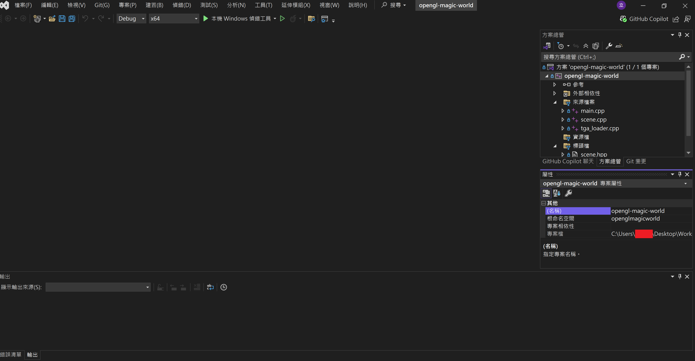

# Visual Studio 2022 IDE 開發說明

## 前置作業

1. 官網下載並安裝 [Visual Studio 2022 Community](https://visualstudio.microsoft.com/zh-hant/downloads/)
2. 選擇「使用 C++ 的桌面開發」安裝

## 開啟 Visual Studio 2022 IDE 步驟

1. Clone 此專案
2. 在 Visual Studio 2022 IDE 中選擇「開啟專案或解決方案」
3. 找到此專案資料夾，選擇開啟「opengl-magic-world.sln」
4. 即可進到專案頁面
    

## 新增檔案、移除檔案

參考: [專案新增檔案教學](./專案新增檔案教學.md)
