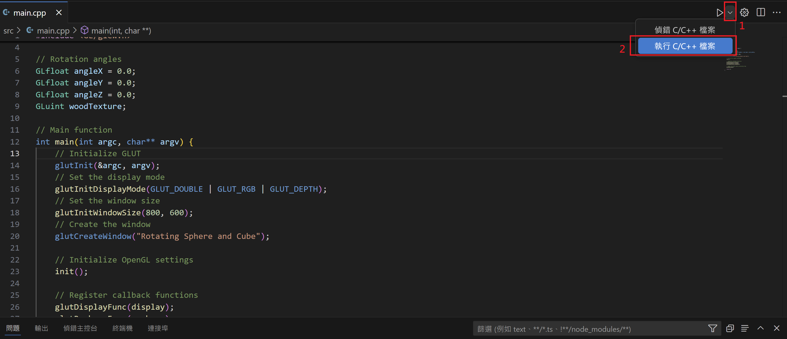
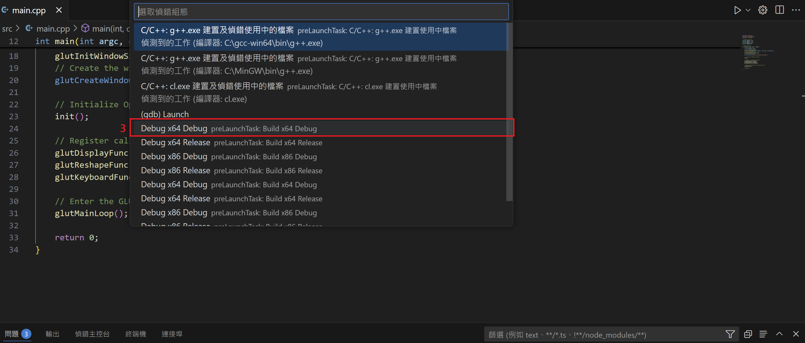
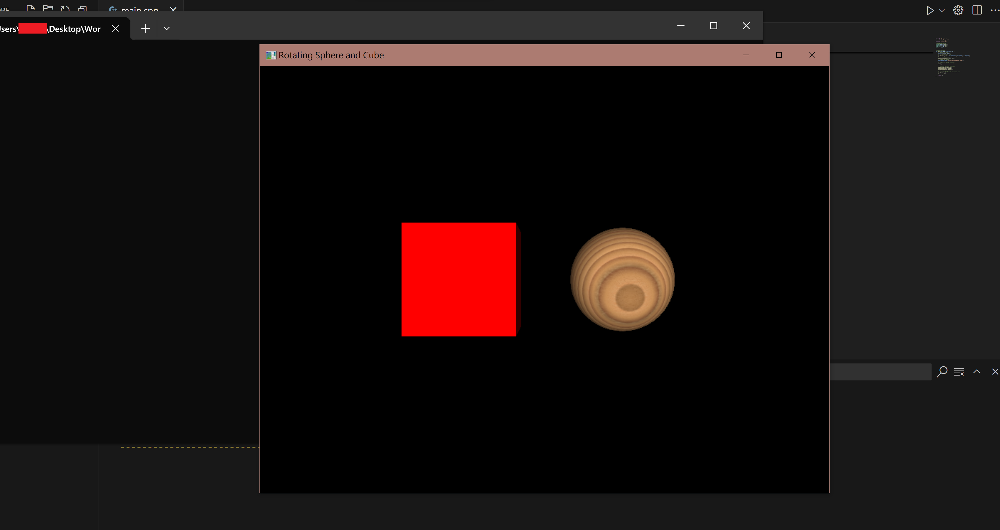

# Visual Studio Code 開發說明

## 前置作業

1. 官網下載並安裝 [Visual Studio 2022 Community](https://visualstudio.microsoft.com/zh-hant/downloads/)
2. 選擇「使用 C++ 的桌面開發」安裝

## 開啟 VSCode 步驟

1. Clone 此專案
2. 系統中搜尋並開啟 "x64 native tools command prompt"
    
3. `cd` 至此專案資料夾內
4. 輸入 `code .`
    
5. 開啟成功

## 執行步驟

1. 進入專案後，開啟 `main.cpp`，點選右上角箭頭，選擇「執行 C/C++ 檔案」，選擇「Debug x64 Debug」
    
    
2. 執行成功
    
