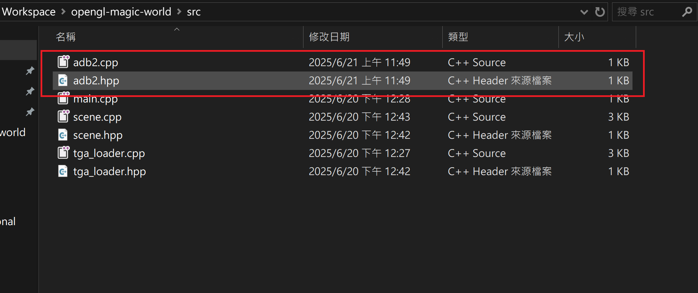

# 專案新增檔案教學

## 前置作業

1. 官網下載並安裝 [Visual Studio 2022 Community](https://visualstudio.microsoft.com/zh-hant/downloads/)
2. 選擇「使用 C++ 的桌面開發」安裝

## 新增檔案步驟

1. 將欲新增的檔案建立至 `src` 資料夾，例如 `adb2.hpp` 及 `adb2.cpp`
    
2. 用 Visual Studio 2022 IDE 開啟專案，開啟步驟可洽[Visual Studio 2022 IDE 開發說明](./Visual%20Studio%202022%20IDE%20開發說明.md)
3. 右方來源檔案 > 加入 > 現有項目
    
4. 選擇剛才的檔案 `adb2.hpp` 及 `adb2.cpp`，點選「加入」
    
5. 於方案總管確認加入成功
    

通常將 `.cpp` 檔加入至「來源檔案」、`.hpp` 檔加入至「標頭檔」、`.obj` 以及 `.tga` 等模型或材質圖片檔加入至「資源檔」，以上教學步驟僅為示範，未遵照最佳實踐。

## 移除檔案步驟

1. 從方案總管選藥要移除的檔案
2. 右鍵 > 移除
    
3. 於方案總管確認移除成功
