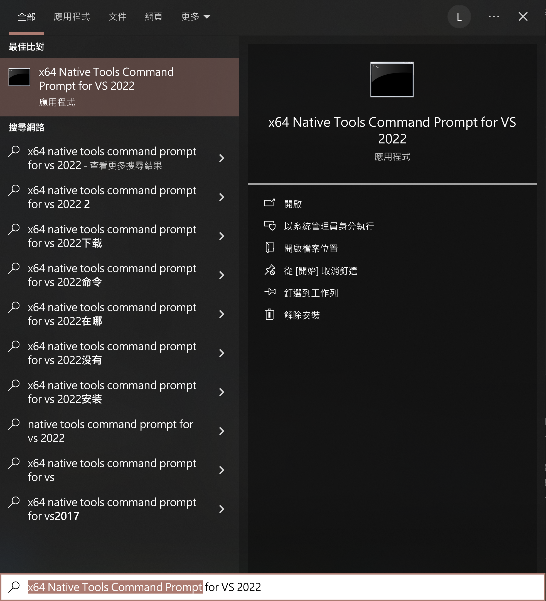
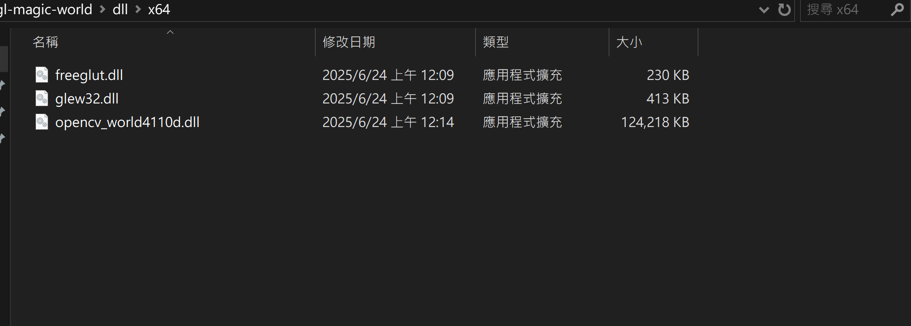
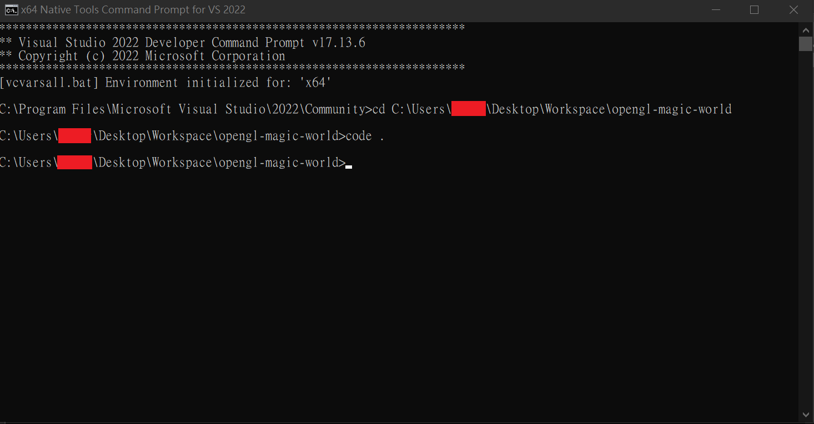

# 部屬專案教學

## 前置作業

1. 官網下載並安裝 [Visual Studio 2022 Community](https://visualstudio.microsoft.com/zh-hant/downloads/)
2. 選擇「使用 C++ 的桌面開發」安裝

## 部屬教學

1. Clone 此專案
2. 系統中搜尋並開啟 "x64 native tools command prompt"
    
3. `cd` 至此專案資料夾內
4. 下載 `opencv_world4110d.dll` (連結如下: https://drive.google.com/file/d/1IUnfJ2kLwZR58rCfhqqzdDZE3IWZA2e2/view?usp=sharing)，並將其置於專案路徑 `dll\x64\`，放置完成後 `dll\x64\` 路徑應該如下圖
    
5. 輸入指令 `msbuild`
6. 輸入指令 `xcopy dll\x64\* x64\Debug /Y`
7. 執行指令 `x64\Debug\opengl-magic-world.exe`，即可看到執行結果
    
